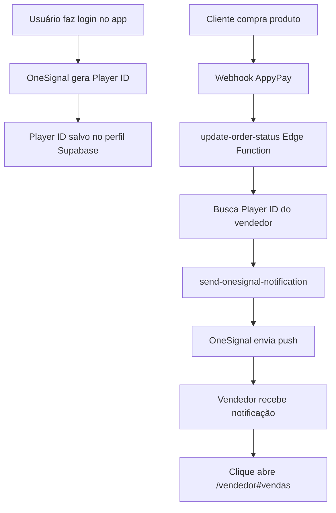

# 📱 Instruções de Configuração - OneSignal Push Notifications

## ✅ O que já está implementado

Parabéns! As notificações push OneSignal **já estão totalmente implementadas** no Kambafy:

1. ✅ **SDK OneSignal** integrado no app (Android/iOS via Capacitor)
2. ✅ **Player ID** é automaticamente gerado e salvo no perfil do vendedor
3. ✅ **Backend** envia notificações quando há vendas
4. ✅ **Navegação** automática para página de vendas ao clicar na notificação
5. ✅ **Funciona com app fechado** - notificações chegam mesmo offline

## 🔧 Configuração do OneSignal

### 1. Credenciais do OneSignal

Você precisa configurar as seguintes credenciais no Lovable Cloud:

```
ONESIGNAL_APP_ID=85da5c4b-c2a7-426f-851f-5c7c42afd64a
ONESIGNAL_REST_API_KEY=[sua-chave-rest-api]
```

**Onde encontrar:**
1. Acesse [OneSignal Dashboard](https://app.onesignal.com/apps/85da5c4b-c2a7-426f-851f-5c7c42afd64a/settings)
2. Vá em **Settings > Keys & IDs**
3. Copie o **REST API Key**
4. No Lovable, vá em **Cloud > Secrets** e adicione `ONESIGNAL_REST_API_KEY`

### 2. Configurar Firebase Cloud Messaging (FCM) - Android

⚠️ **OBRIGATÓRIO para Android funcionar!**

1. Acesse [Firebase Console](https://console.firebase.google.com/)
2. Crie/acesse o projeto Firebase do Kambafy
3. Vá em **Project Settings > Cloud Messaging**
4. Copie:
   - **Server Key**
   - **Sender ID**
5. No OneSignal:
   - Acesse [Google Android (FCM)](https://app.onesignal.com/apps/85da5c4b-c2a7-426f-851f-5c7c42afd64a/settings/platforms/google_android_fcm)
   - Cole **Server Key** e **Sender ID**
   - Clique em **Save**

### 3. Configurar iOS (Opcional)

Para iOS, você precisa:
1. Certificado de push notification da Apple
2. Configurar no OneSignal Dashboard
3. Seguir [este guia](https://documentation.onesignal.com/docs/generate-an-ios-push-certificate)

## 🚀 Como Testar

### Passo 1: Build e Sync do App

```bash
# 1. Pull do código
git pull

# 2. Instalar dependências
npm install

# 3. Build
npm run build

# 4. Sync com Capacitor
npx cap sync android
```

### Passo 2: Executar no Android

```bash
npx cap run android
```

### Passo 3: Testar o Fluxo

1. **Abra o app** no dispositivo Android
2. **Aceite as permissões** de notificação quando solicitado
3. **Faça login** como vendedor
4. Verifique nos logs: `✅ OneSignal Player ID: [seu-id]`

### Passo 4: Fazer uma Venda de Teste

**Opção A: Venda Real**
1. Acesse a página do produto
2. Faça uma compra usando AppyPay Express
3. Aguarde a confirmação

**Opção B: Venda Manual**
1. Acesse o painel admin
2. Crie um pedido manualmente
3. Altere status para `completed`

### Passo 5: Receber Notificação

Você receberá:
```
📱 Nova venda realizada! 🎉
Parabéns! João Silva comprou Curso de Marketing por 150.00 KZ
```

Ao clicar, será direcionado para `/vendedor#vendas`

## 🔍 Troubleshooting

### Notificação não chegou?

**1. Verificar Player ID no Supabase**
```sql
SELECT user_id, onesignal_player_id 
FROM profiles 
WHERE user_id = '[seu-user-id]';
```

**2. Verificar Logs das Edge Functions**
- [send-onesignal-notification logs](https://supabase.com/dashboard/project/hcbkqygdtzpxvctfdqbd/functions/send-onesignal-notification/logs)
- Procure por `✅` ou `❌` nos logs

**3. Verificar OneSignal Dashboard**
- [OneSignal Messages](https://app.onesignal.com/apps/85da5c4b-c2a7-426f-851f-5c7c42afd64a/notifications)
- Veja se a notificação foi enviada

**4. Verificar Permissões Android**

Confirme no `android/app/src/main/AndroidManifest.xml`:
```xml
<uses-permission android:name="android.permission.POST_NOTIFICATIONS"/>
<uses-permission android:name="android.permission.INTERNET"/>
<uses-permission android:name="android.permission.VIBRATE"/>
```

### OneSignal não inicializa?

```bash
# Reinstalar plugin
npm install onesignal-cordova-plugin
npx cap sync android

# Limpar cache Android Studio
# Build > Clean Project
# Build > Rebuild Project
```

## 📊 Como Funciona o Fluxo



## 🎯 Arquivos Implementados

- ✅ `src/hooks/useOneSignal.ts` - Hook de integração OneSignal
- ✅ `src/App.tsx` - Inicialização e navegação
- ✅ `capacitor.config.ts` - Configuração OneSignal App ID
- ✅ `supabase/functions/send-onesignal-notification/` - Edge Function envio
- ✅ `supabase/functions/update-order-status/` - Trigger de vendas
- ✅ `supabase/functions/appypay-webhook/` - Webhook AppyPay

## 📝 Próximos Passos

1. ✅ Adicionar `ONESIGNAL_REST_API_KEY` no Lovable Cloud Secrets
2. ✅ Configurar FCM no Firebase + OneSignal
3. ✅ Testar no dispositivo Android
4. ⏳ (Opcional) Configurar iOS

## 🆘 Suporte

- [OneSignal Docs](https://documentation.onesignal.com/)
- [Capacitor OneSignal Plugin](https://github.com/OneSignal/onesignal-cordova-plugin)
- [Firebase Console](https://console.firebase.google.com/)

---

**Nota:** O sistema só envia notificações quando o pedido está com status `completed` ✅
